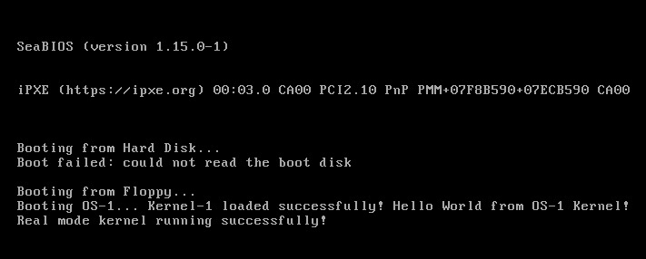

# OS-1

Learning to build a simple operating system from scratch. This is basically a vibe learning project.

This repo was created back in feb 2023, but I never finished it. Now that I know what works best for me, I started this project again.

> This is a hobby project

I am learning OSdev using claude and cursor. I am also writing about it on my blog and youtube.

##### Links:
- [Os Devlog Blog](https://saiyashwanth.tech/osdevlogs/root)
- [Os Devlog Youtube](https://www.youtube.com/channel/UCCW3KygiFpX7NV5Xy2yswCA)

